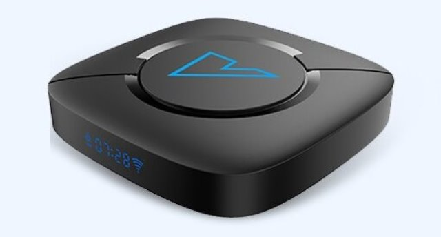

# Allwinner H616 Vontar V6 Android Tv Box

  

## Specification

- CPU – 4x ARM Cortex-A53 @ 1.51 GHz
- GPU – ARM Mali-G31 MP2 @ 650 MHz
- Memory – 4GB DDR3-4
- Storage – 16GB eMMC flash + micro SD card slot (up to 64GB)
- Connectivity – 100M Ethernet, 802.11 a/b/g/n/ac Wi-Fi
- USB – 2x USB 2.0 host ports
- Misc – IR receiver
- Power Supply – DC 5V/2A

## Analogies

- T95H
- Tanix TX6s
- X96 Mate
- Xunlong Orange Pi Zero2
